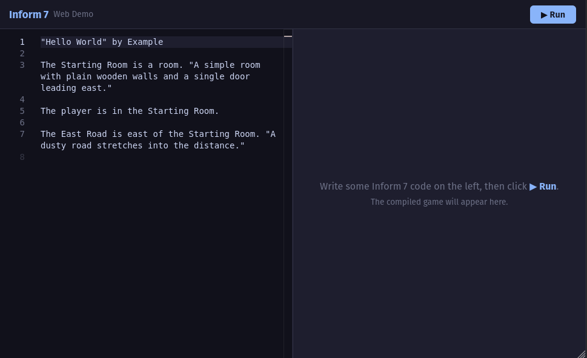

# inform7-wasm

[](https://zicklag.github.io/inform7-wasm/)

**[Try the web demo →](https://zicklag.github.io/inform7-wasm/)**

A fully reproducible build of the [Inform 7](https://ganelson.github.io/inform-website/) toolchain as **pure WASI modules** — no JavaScript glue, no native dependencies at runtime.

Compile Inform 7 source text (`.ni`) into playable Glulx story files (`.gblorb`) on any platform with a WASI runtime — Node.js, Deno, wasmtime, or even the browser.

## What's in this repo

- **WASM binaries** — `inform7.wasm`, `inform6.wasm`, and `inblorb.wasm` compiled from the official Inform 7 source, plus the build scripts and patches
- **JS package** — [`inform7`](https://www.npmjs.com/package/inform7) on npm (also `inform7-wasm`), a TypeScript library for compiling stories in Node.js, Deno, and the browser with a simple `compile()` call
- **Web demo** — A browser-based IDE at [`packages/web-demo/`](packages/web-demo/) that compiles and runs stories entirely client-side using Monaco editor and a Glulx interpreter
- **CI/CD** — GitHub Actions workflow that automatically builds and deploys the web demo to GitHub Pages

## Quick Start

### Prerequisites

- [pixi](https://pixi.sh/) — for the build environment (provides clang, lld)
- `wget` — for downloading WASI SDK dependencies
- `git` — for submodules

### Build the WASM binaries

```bash
git clone https://github.com/zicklag/inform7-wasm.git
cd inform7-wasm
git submodule update --init --recursive
pixi install
pixi run build
```

Output goes to `build/`:
```
build/
├── inform7.wasm       # .ni → .i6 compiler
├── inform6.wasm       # .i6 → .ulx compiler
├── inblorb.wasm       # .ulx → .gblorb packager
├── Internal/          # resource files (CSS, templates, languages, kits)
└── wasi-stubs.o       # POSIX stubs (pthread, system, clock)
```

### Compile a Story

#### Using the JS package (recommended)

```bash
pnpm install
pnpm build:wasm    # build WASM binaries (or use pre-built ones)
pnpm build:package # build the JS package with assets

# High-level API — single function call
node examples/high-level.mjs

# Low-level API — step-by-step control
node examples/low-level.mjs

# File-based compilation (uses Node.js WASI directly)
node examples/compile.mjs /path/to/My\ Project
```

#### Using wasmtime

```bash
bash examples/compile-wasmtime.sh /path/to/My\ Project
```

### Project Structure

Your project directory should look like:

```
My Project/
├── Source/
│   └── story.ni          # Your Inform 7 source text
├── Build/                # Created by inform7
├── Index/                # Created by inform7
└── My Project.materials/ # Created by inform7
  └── Extensions/        # Project-specific extensions
```

## JS Package

The [`inform7`](https://www.npmjs.com/package/inform7) npm package (also importable as `inform7-wasm`) provides two APIs:

### High-level API

```typescript
import { compile } from "inform7";

const result = await compile({
  source: `"Hello World" by Example

The Starting Room is a room. "A simple room."
The player is in the Starting Room.`,
});

// result.output.gblorb — Uint8Array of the playable file
// result.output.ulx    — Uint8Array of the Glulx story
// result.output.inf   — Uint8Array of the generated Inform 6 code
```

### Low-level API

```typescript
import { runWasi, parseVirtualFS } from "inform7";

// Run each binary step by step with a custom virtual filesystem
const fs = { ...inform7Internal, "/my-project/Source/story.ni": source };
const afterInform7 = await runWasi(inform7, { args: [...], virtualFs: fs });
const afterInform6 = await runWasi(inform6, { args: [...], virtualFs: afterInform7 });
const afterInblorb = await runWasi(inblorb, { args: [...], virtualFs: afterInform6 });
```

See [`examples/high-level.mjs`](examples/high-level.mjs) and [`examples/low-level.mjs`](examples/low-level.mjs) for complete working examples.

## How It Works

### The WASI Approach

All three tools are compiled as **pure WASI Preview 1** modules using `clang` with the `wasm32-wasip1` target. They have zero JavaScript dependencies and can run in any WASI-compliant runtime (wasmtime, wasmer, Node.js WASI, etc.).

### The Function Pointer Fix

Inform 7's method dispatch system stores function pointers as `void*` and casts them back at call sites. The `VOID_METHOD_TYPE` macro declared the function type as returning `void`, but 278 handler functions actually returned `int`. In native C this works (the return value is ignored), but WASM's `call_indirect` requires exact signature match including return type.

The fix: changed all 278 handler functions from `void` to `int` across 86 `.w` source files, plus `return;` → `return 0;` in macro sections. These changes are in the `patches/` directory and are applied to the submodules during build.

## Project Structure

```
inform7-wasm/
├── build.sh                 # Reproducible WASM build script
├── pixi.toml                # Pixi project configuration
├── patches/
│   ├── inform-wasi.patch    # Source patches for inform repo
│   └── inweb-wasi.patch     # Source patches for inweb repo
├── support/
│   ├── wasi-stubs.c         # POSIX stubs (pthread, system, clock)
│   └── custom-include/
│       └── setjmp.h         # WASI-safe setjmp override
├── submodules/
│   ├── inform/              # ganelson/inform @ v10.1.2
│   ├── inweb/               # ganelson/inweb @ v7.2.0
│   └── intest/              # ganelson/intest @ v2.1.0
├── packages/
│   ├── inform7-wasm/        # npm package (TypeScript, Node.js + browser)
│   └── web-demo/            # SvelteKit browser IDE (Monaco + Glulx interpreter)
├── examples/
│   ├── compile.mjs          # File-based compilation via Node.js WASI
│   ├── compile-wasmtime.sh  # File-based compilation via wasmtime
│   ├── high-level.mjs       # JS package high-level API demo
│   ├── low-level.mjs        # JS package low-level API demo
│   └── hello/               # Example "Hello World" story
├── resources/               # (gitignored) Downloaded WASI SDK
└── build/                   # (gitignored) Build output
```

## Dependencies

### Build-time (via pixi / conda-forge)

- `clang` ≥ 22.1.8 — C compiler with WASI target support
- `lld` ≥ 22.1.8 — LLVM linker

### Build-time (downloaded)

- `wasi-sysroot-24.0.tar.gz` — WASI libc headers and libraries
- `libclang_rt.builtins-wasm32-wasi-24.0.tar.gz` — compiler-rt builtins for wasm32

Both are downloaded from the [wasi-sdk releases](https://github.com/WebAssembly/wasi-sdk/releases/tag/wasi-sdk-24) on first build and cached in `resources/`.

### Runtime

- Any WASI Preview 1 runtime (wasmtime, wasmer, Node.js 20+ with `--experimental-wasi-unstable-preview1`, or the browser via `@bjorn3/browser_wasi_shim`)

## License

This project is dedicated to the public domain under the [Unlicense](LICENSE).

## Further Reading

For technical details — how the WASM build works, the function pointer fix, source patches, and build internals — see [HOW.md](HOW.md).
